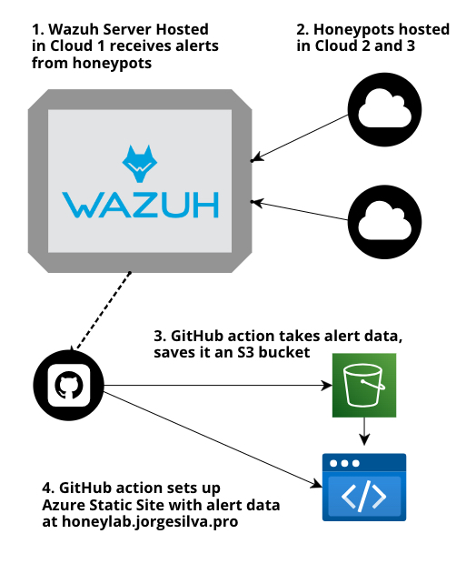

# Honeylab 

Honeylab is a project to analyze data collected from cloud honeypots using Wazuh. 

This project leverages multiple cloud providers to set up honeypots and utilizes GitHub Actions for automated public reporting. The collected data is displayed on a static page. 

The objective is to use this data to analyze and research threats, gaining valuable insights into malicious activities.

Live site hosted at: https://honeylab.jorgesilva.pro/

# Blueprint

Note: The Infrastructure as Code for the resources above is not public to hide the cloud providers that I'm using. I might make it public later

# Installation process

1. Install Wazuh with https://documentation.wazuh.com/current/quickstart.html
2. Install the Agents on Honeypots https://documentation.wazuh.com/current/installation-guide/wazuh-agent/index.html
3. Save the secrets required in the `summary_upload.yml` action file.

# Alerts Processing Steps

1. The GitHub Action runs every day at 6 PM or when manually activated
2. It first runs the `fetch_alerts.sh` file to get all alerts from the last 7 days
3. Then it runs the `analyze_alerts.py` file to make a summary of the data
4. It then uploads the summary as a JSON to an S3 bucket
5. A static site hosted in Azure gets the summary and presents it at https://honeylab.jorgesilva.pro

## TODO

- Configure vulnerabilities in the honeypots
- Enhance the public summary
- Further analyze the data with additional tools
